# System Architecture & Technical Design

เอกสารนี้แสดงแผนผังโครงสร้างสถาปัตยกรรมระบบของ **Unicorn Global Commerce Platform** เพื่อใช้ควบคุมโครงสร้างการออกแบบและการเชื่อมต่อระหว่างเทคโนโลยีของแพลตฟอร์ม

---

## 🗺️ System Diagram

แผนผังการไหลของข้อมูลและการทำงานร่วมกันระหว่างส่วนบริการต่างๆ ภายใต้ระบบนิเวศของ Cloudflare และ Supabase:

```mermaid
graph TD
    subgraph Client ["Client Layer"]
        UserAgent["Web Browser / PWA (Remix Client)"]
    end

    subgraph CDN ["Cloudflare Edge Network"]
        Remix["Remix (Frontend SSR on Edge Workers)"]
        WorkersAPI["Workers API (Backend Core Microservices)"]
        WorkersAI["Workers AI (Vector Search, LLM, Translation)"]
        R2["Cloudflare R2 (Asset & Media Storage)"]
        Analytics["Cloudflare Analytics (Traffic & Usage Logs)"]
    end

    subgraph DB ["Supabase Cloud"]
        S_Auth["Supabase Auth (Authentication & Session Management)"]
        S_PG["Supabase Postgres (Transactional DB / Ledger)"]
        S_Realtime["Supabase Realtime (Websockets for Chat & Alerts)"]
        S_Storage["Supabase Storage (Alternative File Caching)"]
    end

    subgraph Integrations ["External APIs / Financial Services"]
        Resend["Resend (Transactional & Promo Email)"]
        LineAPI["LINE Messaging (Local Notification Thailand)"]
        Stripe["Stripe Gateway (Fiat Escrow, Processing Fee)"]
        Wise["Wise Platform (International Cross-border Settlement)"]
    end

    %% Connections
    UserAgent <-->|HTTPS / Assets| Remix
    UserAgent <-->|REST / GraphQL / Websockets| WorkersAPI
    UserAgent <-->|Websockets| S_Realtime
    
    Remix <-->|Internal Fetch| WorkersAPI
    Remix -.->|Auth Session| S_Auth
    
    WorkersAPI <-->|SQL / Transactions| S_PG
    WorkersAPI <-->|Identity Check| S_Auth
    WorkersAPI <-->|Read / Write Assets| R2
    WorkersAPI <-->|AI Inference Requests| WorkersAI
    
    WorkersAPI <-->|Mail Delivery| Resend
    WorkersAPI <-->|LINE Hooks & Push| LineAPI
    WorkersAPI <-->|Card Payment & Escrow Lock| Stripe
    WorkersAPI <-->|FX & Global Payouts| Wise
    
    Remix & WorkersAPI -->|Log Data| Analytics
```

---

## 🗂️ Business Domains Responsibilities

การพัฒนาโค้ดและการออกแบบตารางฐานข้อมูลจะอิงตามหลัก **Domain Driven Design (DDD)** โดยแบ่งออกเป็น 12 โดเมนหลักดังนี้:

### 1. `identity`
* **หน้าที่หลัก**: ระบบเข้าถึงและการจัดการข้อมูลตัวตนของสมาชิก (Authentication, Authorization)
* **การทำงาน**: รองรับ OAuth, Session Management และระบบความปลอดภัยในการเข้าถึงข้อมูล (RBAC)

### 2. `membership`
* **หน้าที่หลัก**: การจัดการระดับการสมัครสมาชิก สิทธิประโยชน์ และการคิดค่าบริการรายเดือน (Subscription Plans)
* **การทำงาน**: บันทึกสิทธิ์และแพ็กเกจของผู้ประกอบการแต่ละราย

### 3. `merchant`
* **หน้าที่หลัก**: การจัดการหน้าร้านและการยืนยันตนของผู้ประกอบการ (Business Profile & Verification/KYB)
* **การทำงาน**: ระบบเก็บข้อมูลภาษี สัญชาติธุรกิจ เอกสารสิทธิ์ และความน่าเชื่อถือ

### 4. `directory`
* **หน้าที่หลัก**: ระบบสมุดรายนามธุรกิจ ค้นหาคู่ค้า และระบบจัดประเภทกลุ่มธุรกิจ (Trade Chambers)
* **การทำงาน**: ค้นหาคู่ค้าผ่านที่ตั้ง, อุตสาหกรรม หรือประเทศ

### 5. `marketplace`
* **หน้าที่หลัก**: การจัดการรายการสินค้า/บริการ แคตตาล็อก การลงขาย และตระกร้าสินค้า (Listings Catalog)
* **การทำงาน**: โพสต์เสนอขาย ค้นหา รายละเอียด และระบุการขนส่งแบบทั่วไป

### 6. `wallet`
* **หน้าที่หลัก**: การจัดการกระเป๋าคะแนนระบบเครดิต (Unicorn Credits Ledger)
* **การทำงาน**: บันทึกยอดเงินคงเหลือ ยอดที่ถูกล็อก (Hold) และประวัติธุรกรรมเพื่อป้องกันการฉ้อโกง (Ledger Journal)

### 7. `barter`
* **หน้าที่หลัก**: ตรรกะการจัดทำสัญญาเสนอแลกเปลี่ยน (Barter Offers/Requests/Trade Ring)
* **การทำงาน**: การแลกเปลี่ยนตรงตัว (Bilateral) หรือแลกเปลี่ยนผ่านกลุ่มธุรกิจ (Multi-lateral)

### 8. `escrow`
* **หน้าที่หลัก**: ระบบล็อกคะแนนเครดิตและการค้ำประกันระหว่างทำธุรกรรมแลกเปลี่ยน
* **การทำงาน**: ล็อกมูลค่า Unicorn Credits ใน Wallet เพื่อประกันความมั่นใจจนกว่าสินค้าจะส่งถึงมือปลายทางอย่างสมบูรณ์

### 9. `settlement`
* **หน้าที่หลัก**: ธุรกรรมที่เกี่ยวกับระบบการเงินภายนอก (Fiat Currency) และการโอนเงินระหว่างประเทศ
* **การทำงาน**: เชื่อม Stripe ในการดึงเงิน/หักค่าธรรมเนียม และ Wise ในการชำระเงินข้ามพรมแดนปลายทาง

### 10. `community`
* **หน้าที่หลัก**: ระบบเชื่อมโยงกลุ่มคู่ค้า แชตรูปแบบต่างๆ และงานกิจกรรม (Networking Hub)
* **การทำงาน**: กลุ่มสมาคมธุรกิจ, แชตสนทนาข้ามชาติพร้อมระบบแปลภาษาอัตโนมัติ

### 11. `ai`
* **หน้าที่หลัก**: สมองกลจัดการจับคู่ (Smart Matchmaking Engine) และผู้ช่วยแนะนำการค้าระหว่างประเทศ
* **การทำงาน**: จัดเก็บประวัติ, คำนวณเวกเตอร์ความคล้าย และให้การแนะนำการทำตลาด

### 12. `admin`
* **หน้าที่หลัก**: แผงควบคุมระบบงานสำหรับเจ้าหน้าที่ดูแลแพลตฟอร์ม (Platform Operator Portal)
* **การทำงาน**: การตรวจเช็กข้อพิพาท (Disputes), การยืนยันเอกสารธุรกิจ (KYB Approval) และการตรวจสอบเครดิต
